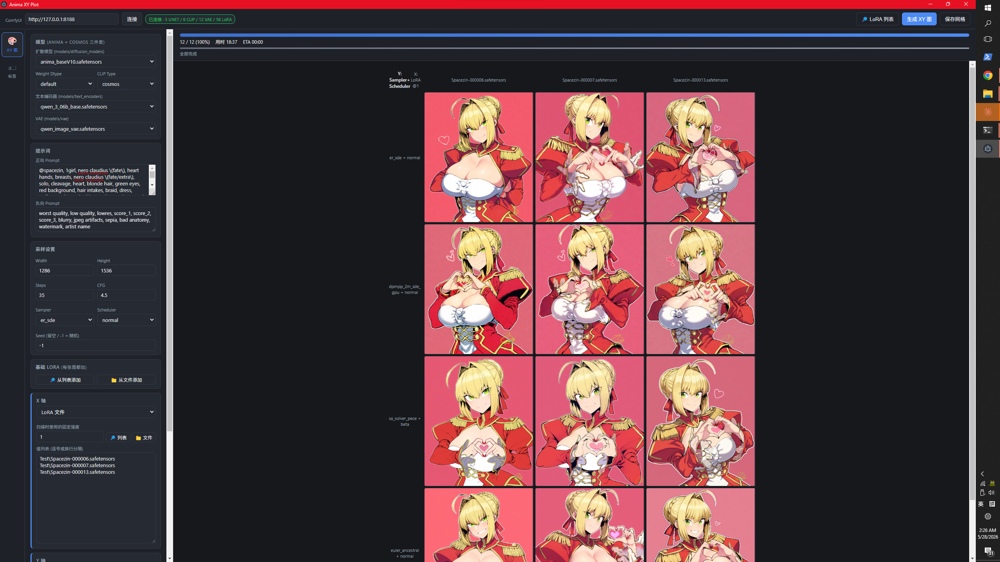

# Anima Toolbox

围绕 [Anima](https://huggingface.co/circlestone-labs/Anima) 模型（基于 NVIDIA Cosmos-Predict2-2B）和它的 LoRA 生态的桌面端工具集。Electron + 本地 ComfyUI 后端。

两大模块：

1. **🧮 XY 图生成** — 仿 [sd-webui-advanced-xyz](https://github.com/Haoming02/sd-webui-advanced-xyz) 的轴编辑器，扫 LoRA 权重 / 多 LoRA / Seed / CFG / Steps / Sampler / Scheduler / Sampler+Scheduler 组合
2. **🏷 打标工具** — 内置 [Camie-Tagger v2](https://huggingface.co/Camais03/camie-tagger-v2)（70k+ danbooru tag、ViT 143M 参数），支持单图 / 数据集编辑 / 整目录批量



---

## 前置依赖

### 1. ComfyUI 在跑
默认监听 `http://127.0.0.1:8188`：

```
cd ComfyUI
python main.py
```

### 2. Anima 三件套
从 https://huggingface.co/circlestone-labs/Anima 下载，按如下目录摆放：

```
ComfyUI/
└── models/
    ├── diffusion_models/anima-base-v1.0.safetensors   (UNETLoader)
    ├── text_encoders/qwen_3_06b_base.safetensors      (CLIPLoader, type=cosmos)
    └── vae/qwen_image_vae.safetensors                  (VAELoader)
```

### 3. 测试用的 LoRA
丢到 `ComfyUI/models/loras/`（可放子目录）。**注意**：放进去之后**重启 ComfyUI**，否则 `/object_info` 扫不到新文件。

### 4. Node.js 18+

---

## 安装 & 启动

```bash
git clone https://github.com/Lambda-D3L7A/anima-toolbox.git
cd anima-toolbox
npm install
npm start
```

打包成单文件 Windows 安装包：

```bash
npm run dist
```

或者双击仓库根目录的 `启动.bat`（自动跑 `npm install` + `npm start`）。

---

## 🧮 XY 图模块

### 基本流程

1. 顶部填 ComfyUI 地址，点「连接」拉模型 / LoRA / sampler 列表
2. 左侧「模型」自动选中 Anima 三件套（按文件名匹配）：
   - Diffusion: `anima-base-v1.0.safetensors`（或类似）
   - Text Encoder: `qwen_3_06b_base.safetensors`
   - CLIP Type: `cosmos`
   - VAE: `qwen_image_vae.safetensors`
   - Weight Dtype: `default`（显存吃紧可换 `fp8_e4m3fn`）
3. 填正负 prompt、尺寸、采样设置
   - 官方推荐：Steps 30–50，CFG 4–5，Sampler `er_sde`/`euler_a`/`dpmpp_2m_sde_gpu`
   - Seed 填 `-1` 或留空 → 随机一次，所有单元格复用同一种子（方便对比其它轴）
4. **基础 LoRA**：每张图都附加的固定 LoRA。两种添加方式：
   - 🔎 **从列表添加**：弹窗显示 ComfyUI 已扫描的所有 LoRA，搜索 + 多选
   - 📁 **从文件添加**：调起文件资源管理器
5. **X 轴 / Y 轴**：分别选轴类型 + 值列表

### 支持的轴类型

| 类型 | 说明 | extras |
|---|---|---|
| `LoRA 权重` | 扫单个 LoRA 不同强度 | 选目标 LoRA，值如 `0.2, 0.4, 0.6, 0.8, 1.0` |
| `LoRA 文件` | 扫多个 LoRA 文件，固定强度 | 设固定强度，🔎 / 📁 多选追加 |
| `Seed` | 数值列表 | — |
| `CFG` | 数值列表 | — |
| `Steps` | 数值列表 | — |
| `Sampler` | ✅ 复选框列表（全选 / 清空） | 自动列出 ComfyUI 已知的全部 sampler |
| `Scheduler` | ✅ 复选框列表 | 同上 |
| `Sampler + Scheduler` | ✅ 组合 chip 列表 | 一格定一对，如 `er_sde + normal` |
| `— 无 —` | 该方向单列/单行 | — |

### 进度 / 历史

- **大进度条**：当前格步数 + 总进度 + 用时 + ETA
- **取消按钮**：第一次点平稳停止，8 秒未响应或第二次点 → 强制重置
- **已完成的 XY 图**：当前网格下方按时间倒序保留最近 12 张，可一键「↑ 设为当前」恢复 / 保存为 PNG / 删除
- **失败单元格**：点击查看完整错误。LoRA 类错误会自动附上 ComfyUI 当前可用列表 + basename 模糊匹配建议

### 保存

「保存网格」把整张拼图（含 X / Y 标签）合成 PNG 导出。

---

## 🏷 打标模块

工具栏切到「🏷 标签」视图。三个子模式：

### 单图打标

- 拖拽图片或「📁 选择图片」加载
- 「识别」跑推理
- 阈值滑块即时过滤（无需重跑）
- tag chip 可点击切换勾选
- 「📋 复制为 Anima 格式」：artist 加 `@`、下划线换空格、小写，按 `character → copyright → artist → general → meta` 排序

### 数据集编辑

- 选目录（可递归）→ 左侧列表显示所有图片 + 当前 .txt tag 数
- 右侧大图预览 + tag 编辑器（添加 / 删除 / 拖拽排序）
- 批量勾选 + 「🏷 批量自动识别」对选中项跑推理

### 📦 批量打标

- 选目录 → 自动扫描总数 / 已打标 / 未打标
- 勾选项：包含子目录 / 跳过已有 .txt
- 阈值 / 格式（Anima 或原始）/ 模式（替换 vs 合并）
- 进度条 + 用时 + ETA + 实时日志（最多 500 行）
- 可随时取消，已写入的 .txt 保留

### 模型自动下载

首次进入打标模式，点「⬇ 下载模型」一键下载到 `tagger_models/`：
- `camie-tagger-v2.onnx`（~789 MB）
- `camie-tagger-v2-metadata.json`（~8 MB）

支持续传跳过 / 取消 / 完成后自动加载。源自 HuggingFace：https://huggingface.co/Camais03/camie-tagger-v2

### 推理性能

143M 参数 ViT。CPU ~3-10s / 张；Windows 有独显会自动用 **DirectML** 加速（5-10×）。

---

## Anima prompt 提示

- 画师标签格式：`@artist_name`（**小写、下划线换空格、`@` 前缀**）
- 配套的画师筛选工具见 [danbooru-artist-screener](https://github.com/Lambda-D3L7A/danbooru-artist-screener)（如果有）

---

## 项目结构

```
anima-toolbox/
├── main.js              Electron 主进程：ComfyUI 客户端 + 网格调度 + IPC 路由
├── preload.js           contextBridge API
├── workflow.js          ComfyUI workflow JSON 构造器 + 轴覆盖
├── tagger.js            ONNX runtime + sharp 预处理
├── renderer/
│   ├── index.html
│   ├── styles.css
│   └── renderer.js      UI 逻辑（约 2.5k 行）
├── 启动.bat              一键启动（自动 npm install）
└── package.json
```

---

## 已知限制

- **单 GPU 串行**：ComfyUI 队列本身就是串行的
- **无 Z 轴**：需要的话手动跑多次 XY 再人工合并
- **LoRA 权重**：`strength_model` 和 `strength_clip` 绑定为同一个值

---

## 致谢

- [circlestone-labs/Anima](https://huggingface.co/circlestone-labs/Anima) — 模型作者
- [NVIDIA Cosmos-Predict2](https://huggingface.co/nvidia/Cosmos-Predict2-2B) — 底层架构
- [Camais03/camie-tagger-v2](https://huggingface.co/Camais03/camie-tagger-v2) — 打标模型
- [comfyanonymous/ComfyUI](https://github.com/comfyanonymous/ComfyUI) — 后端
- [Haoming02/sd-webui-advanced-xyz](https://github.com/Haoming02/sd-webui-advanced-xyz) — UI 灵感来源

---

## License

MIT
